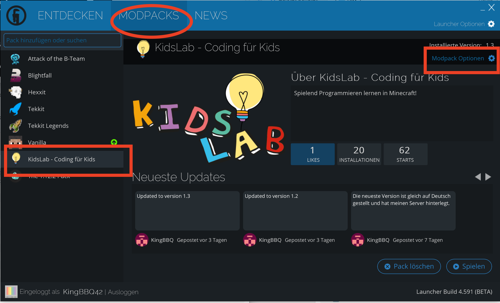
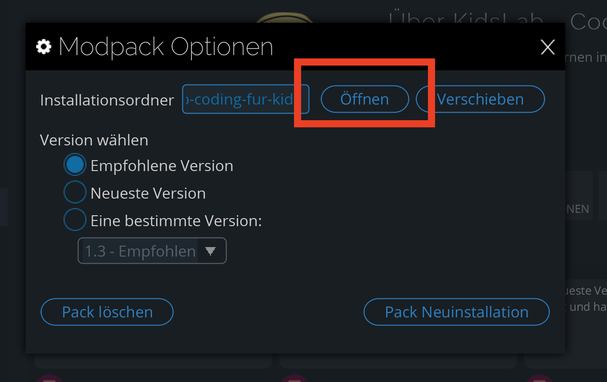
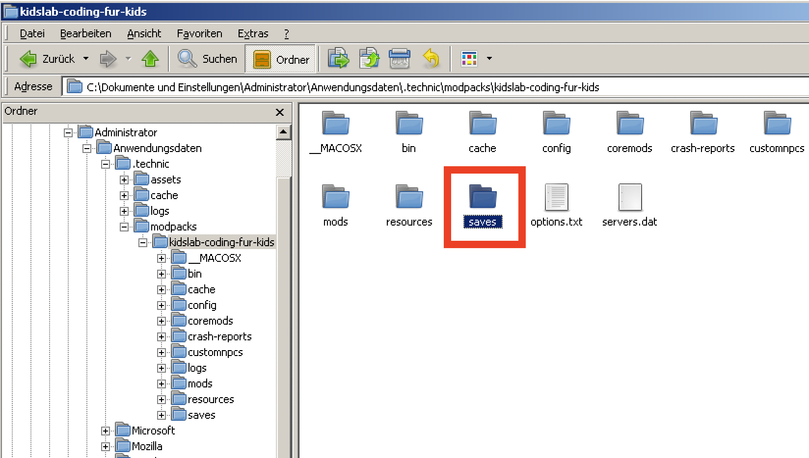
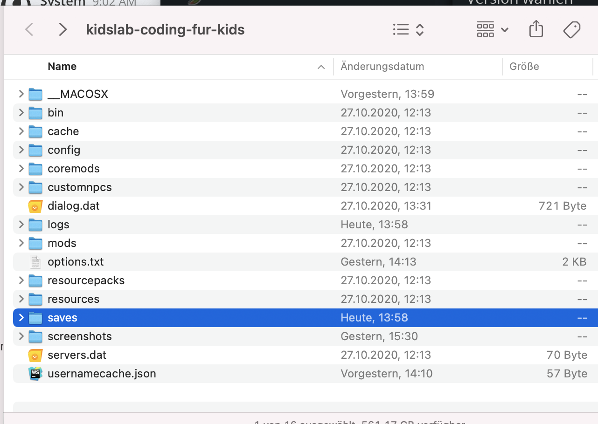
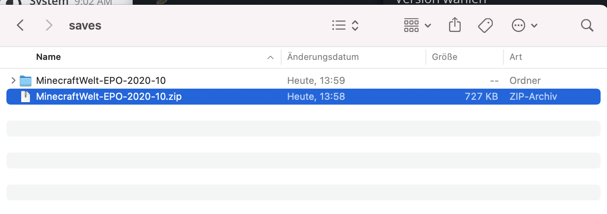
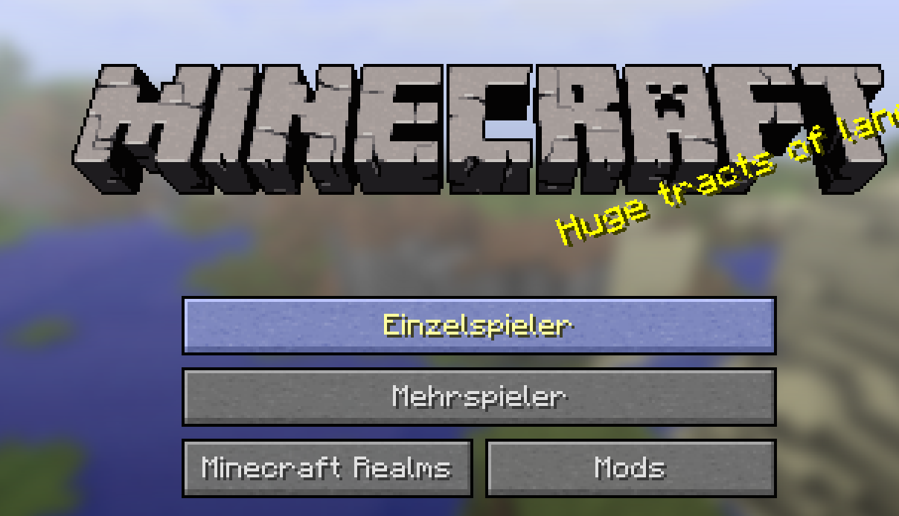
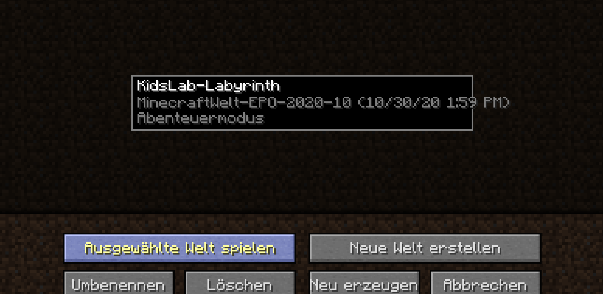

# Welten im Kidslab-Modpack einspielen

In diesem kleinen Tutorial zeige ich Dir, wie du eine abgespeicherte Welt in deiner Minecraft-Version einspielen kannst.

Im ersten Schritt öffne bitte den Techniclauncher:

1. Klicke auf Modpacks
2. Wähle "KidsLab" aus
3. Rechts oben auf den Knopf "Modpack Optionen" klicken

In diesem Dialog siehst du, wo genau diese Minecraft-Installation liegt.

Klicke auf "Öffnen"

:::spoiler Mac Ansicht

:::

Damit kommst du in den Ordner, wo alles liegt.

Die abgespeicherten Spiele liegen im Unterordner "saves":

:::spoiler Mac Ansicht

:::

In diesen Ordner legst du die ZIP-Datei mit der Welt.

Rechts drauf klicken und "Alle Extrahieren" auswählen.

Fertig!

Jetzt nur noch Minecraft starten:

Einzelspieler auswälhen...

Und die neue Welt auswählen!

Viel Spaß beim Bauen und Programmieren :female-cook: 

