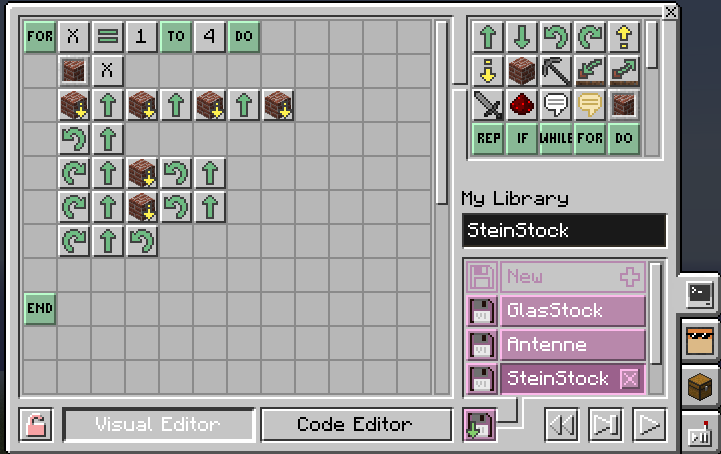

# Stunde 2: Hotelturm

## Was lernen man?

- Verschachtelte Schleifen - der Turm besteht aus jeweils 4 gleiches Stücken pro Stockwerk
- Unterprogramme aufrufen - es gibt ein Hauptprogramm, das jeweils die Unterprogramme StockStein, StockGlas und Antenne aufruft. Verschieden oft natürlich.

## Übersicht

Wir wollen jetzt die Schildkröte was größeres bauen lassen - den Augsburger Hotelturm (Liebevoll auch Lockenwikler oder Maiskolben genannt)

Das ist das Original, dass man auch vom Openlab aus gut sehen kann:

Wenn das ganze fertig ist, soll es so aussehen:

In der Welt gibt es auch jeweils für die beiden Stockwerke ein Beispiel.
Man kann sich natürlich auch eigene Sachen überlegen.

## Programme

**Wichtig ist bei jedem Programm, dass man am Ende wieder an der gleichen Stelle wie am Anfang steht!**

### StockStein

### StockGlas

Eigentlich gleich wie der Stein-Stock, nur eben an den richtigen Stellen jeweils Glas für die Fenster

### Antenne

Natürlich kommt oben drauf noch die bekannte Rot-Weisse Antenne :-)

### Hauptprogramm

Und dieses kleine Programm ruft dann die Unterprogramme jeweils auf und bewegt die Schildröte jeweils einen Stock höher.

