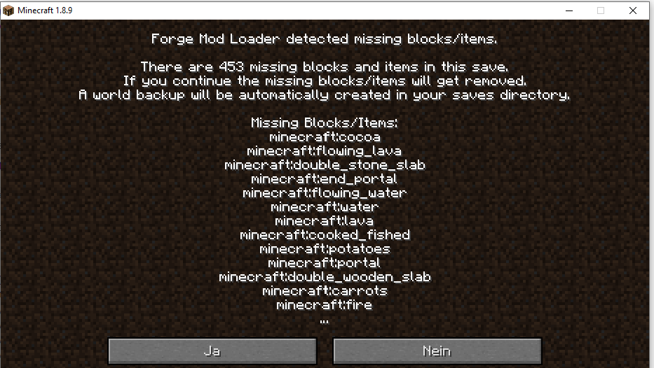

# Bekannte Fehler und Probleme

## "Missing Blocks" beim Laden einer Welten

Meine Welten wurden mit der MinecraftEDU Version erstellt. Es sind die Mods "ComputercraftEDU" und "CustomNPC" installiert (beide im Mods Unterverzeichnis).

Wenn eine der Mods fehlt, kommt bei manchen Welten folgender Fehler:

Durch klicken auf "ja" werden diese fehlerenden Blöcke entfernt. Bei manchen Welten ist das kein Problem, bei anderen fehlt dann eben was :-)

Also besser die Mods alle installieren.
